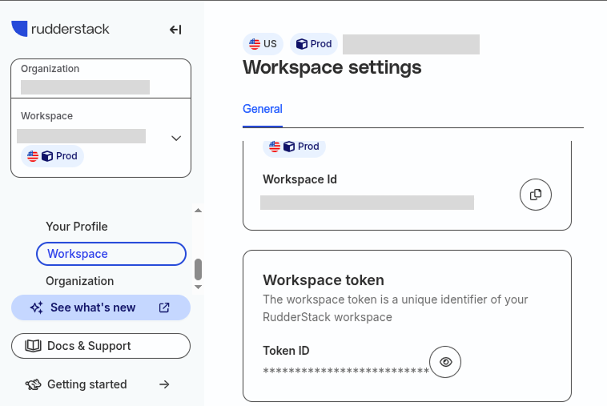
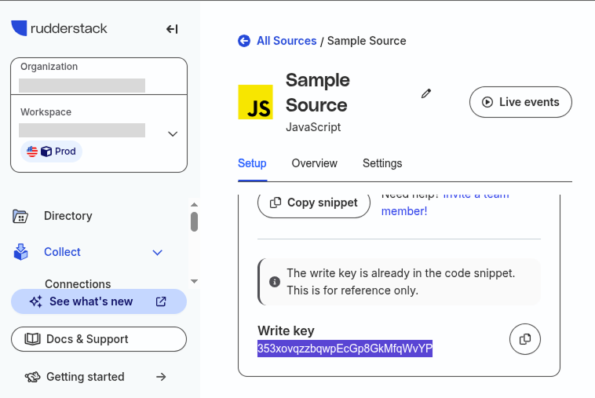
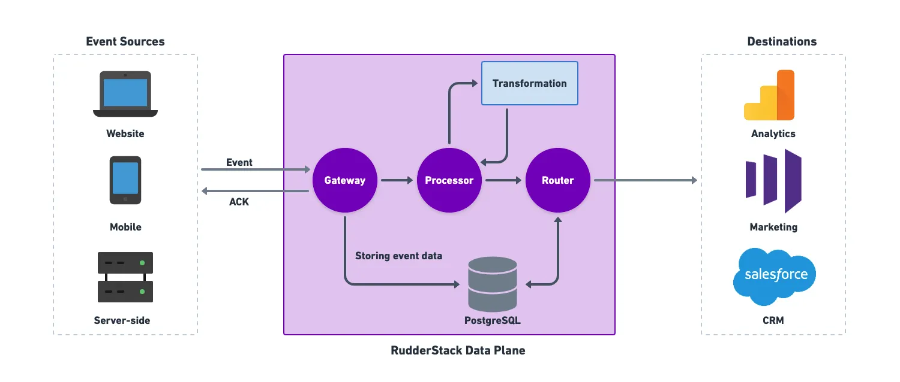

# Rudderstack

## Installation and Testing

1. Create an Open Source account on https://app.rudderstack.com/signup?type=opensource

2. Get the workspace token in Rudderstack


3. Start Rudderstack dataplane container locally with the workspace token in docker compose file
```bash
wget https://raw.githubusercontent.com/rudderlabs/rudder-server/master/rudder-docker.yml
docker compose -f rudder-docker.yml up -d
```

4. Check Data Plane Health
```bash
curl http://localhost:8080/health
```

5. Add a new JavaScript source https://app.rudderstack.com/sources

6. Get the Write Key of your new source


5. Get the shell script to perform a test
```
git clone https://github.com/rudderlabs/rudder-server.git
```

6. Go to the live event of your new source
Ex: https://app.rudderstack.com/sources/live/353xox6jWJhI5OyHYe5EvnQNzqo


7. Send test events and look at the live event
```
cd rudder-server
./scripts/generate-event <WRITE_KEY> <DATA_PLANE_URL>/v1/batch
```
Change <WRITE_KEY> by yours
Change <DATA_PLANE_URL> by http://localhost:8080


Exemple : 
```
./scripts/generate-event 367xhsqzzbqwpEcGp9GkMfqWvYP http://localhost:8080/v1/batch             
```

Alternatively, you can host temporary your data plane with ngrok.

## Collect event from a simple landing page

1. Look at the rubberstack landing page exemple
```bash
cd rudderstack_example
```

2. Put your "write key" and "data_plane_url" in the script javascript line 96

3. Go to the live event of your new source
Ex: https://app.rudderstack.com/sources/live/353xox6jWJhI5OyHYe5EvnQNzqo

3. Start Live Server, send data from the form and watch live event

The events are sent by this method :
```js
rudderanalytics.identify(email)
```

Any values can be send by putting an ID on a form element :
```js
const emailForm = document.querySelector("#email")
const email = emailForm.value
```

Events 



## Glossaire :

**Data Plane**: In RudderStack, the data plane is the core backend engine responsible for receiving, processing, transforming, and routing your event data to the specified destinations. It handles incoming event data from various sources (such as websites, mobile apps, or servers), processes and transforms the data as needed, and then delivers it to destinations like analytics platforms, data warehouses, or marketing tools.

Key points about the data plane:

- It consists of several components: the gateway (receives events), processor (handles processing), transformation module (applies transformations), router (sends data to destinations), and a PostgreSQL database for **temporary event storage**.

- The data plane temporarily stores events in the database to enable retries in case of delivery failures. Events are deleted once successfully delivered.

- The data plane does not persistently store user data or events; it only keeps them as long as needed for processing and delivery.

- In RudderStack Open Source, you are responsible for setting up and hosting your own data plane, typically using Docker, Kubernetes, or directly on your infrastructure.

**Data Warehouse:** A data storage and processing platform for storing and analyzing data

**Customer Data Plateform:** A platform specifically designed to unify customer data from multiple sources and make it accessible to other tools

**ETL (Extract, Transform, Load):**
- Extract: Obtaining data from cloud applications (like Salesforce, HubSpot, Google Analytics, etc.)
- Transform: Converting the data into a format suitable for analysis
- Load: Transferring that data into your data warehouse

**ETL (Cloud Extract)**
- Extracts data from cloud applications (Salesforce, HubSpot, Google Analytics, etc.)
- Loads it into your data warehouse
- Purpose: Centralize data for analytics

**Reverse ETL**
- Extracts enriched data from your data warehouse
- Loads it into operational tools (CRMs, marketing platforms, analytics tools)
- Purpose: Activate warehouse data for business use cases


## FAQ

**Does RudderStack store data permanently data ?**

No, by default, RudderStack does not store any customer event data permanently. Its core function is to collect, process, and route event data from your sources to your chosen destinations (such as databases, data warehouses, analytics tools, or cloud platforms). Events are only stored temporarily during processing and are deleted once they are successfully delivered to the destination.

**Does rudderstack can collect data from my database then transform to a huge client database table ?**

Yes, RudderStack can collect data from your database and transform it before sending it to a destination, including a large client database table, using its **Reverse ETL feature**.